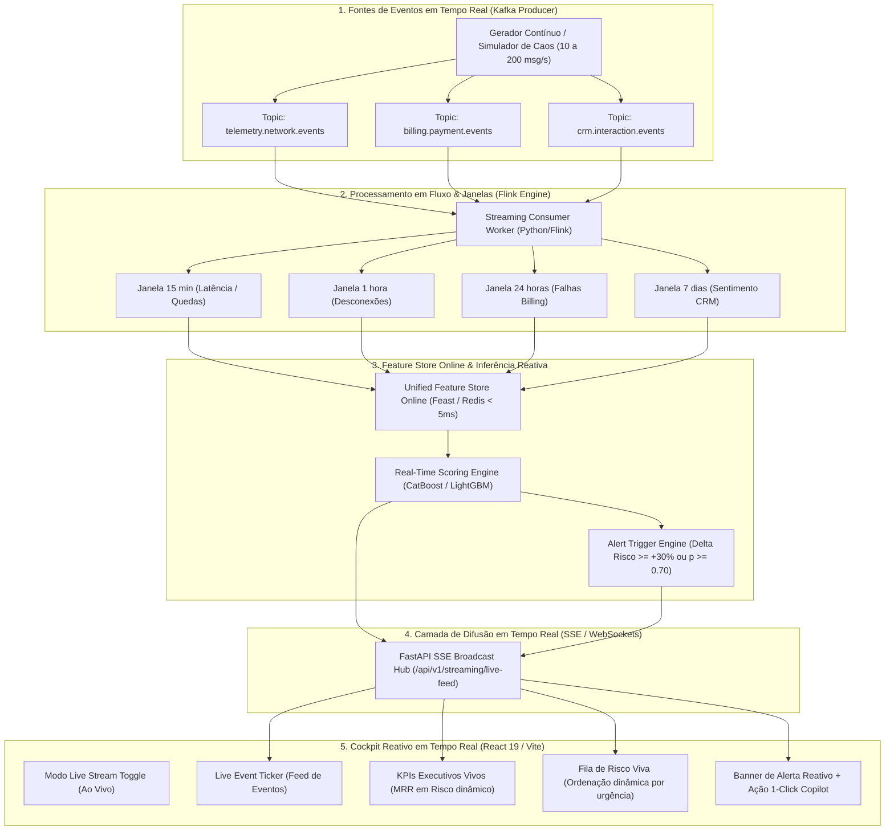

# 📄 PRD — Live Streaming Engine & Real-Time Reactive Cockpit (Fase 3)
## Arquitetura de Ingestão Contínua, Processamento em Fluxo (Flink/Kafka), Feature Store Online e Inferência Reativa em Tempo Real

**Status:** PROPOSTO / PLANEJAMENTO ESTRATÉGICO  
**Versão:** 1.0.0 (Padrão Global Scale-Up / Tier-1 Telecom B2B SaaS)  
**Autor:** Antigravity & Lead Data/ML Platform Engineer  
**Data:** Setembro de 2026  

---

## 1. 🎯 Visão Executiva & Proposta de Valor

### 1.1 Contexto de Negócio
No mercado tradicional de telecomunicações, a detecção de churn é **reativa e atrasada** (analisada em batches D-1 ou D-30 após o fechamento da fatura). Quando a equipe de retenção descobre que o cliente está insatisfeito, ele já assinou com o concorrente.

A plataforma **RetainIQ (Fase 3: Live Streaming Engine)** transforma o paradigma para **Proativo e Reativo em Tempo Real**:
- Eventos de telemetria de rede (quedas de fibra, oscilação de latência, perda de pacotes), eventos de faturamento (PIX recusado, fatura em aberto) e interações no CRM (WhatsApp, abertura de chamados) são **ingeridos em milissegundos via Apache Kafka / Redpanda**.
- Um motor de processamento em fluxo calcula janelas deslizantes (*Stateful Sliding Windows*) e atualiza a **Feature Store Online (Feast/Redis)** em menos de $5\text{ms}$.
- O modelo de Machine Learning **recalcula o risco de churn ao vivo**, transmitindo deltas de risco via **Server-Sent Events (SSE) / WebSockets** diretamente para o **Cockpit do Operador**.
- O sistema dispara alertas automáticos e pré-alimenta o **Copilot GenAI** com o roteiro ideal de retenção antes mesmo do cliente entrar em contato.

---

## 2. 🏗️ Arquitetura Técnica de Referência

---

## 3. 📋 Épicos, Tarefas e Micro-tarefas com Checkpoints

---

### 🟢 ÉPICO 1: Conexão Bidirecional do Live Streaming Hub (SSE / WebSockets)
**Objetivo:** Criar um canal assíncrono de transmissão contínua de telemetria e deltas de risco entre a FastAPI e o Cockpit Frontend.

- [ ] **Tarefa 1.1: Criar o Broadcast Hub de Server-Sent Events (SSE) na FastAPI**
  - [ ] *Micro-tarefa 1.1.1:* Implementar `src/churn_prediction/streaming/broadcaster.py` com fila assíncrona `asyncio.Queue` e gerenciamento de conexões ativas.
  - [ ] *Micro-tarefa 1.1.2:* Criar endpoint `GET /api/v1/streaming/live-feed` com `StreamingResponse(media_type="text/event-stream")`.
  - [ ] *Micro-tarefa 1.1.3:* Adicionar heartbeat a cada 15 segundos para manter conexões abertas sem timeout.
  - 🎯 **Checkpoint 1.1:** Testar endpoint SSE via `curl` e verificar entrega contínua de eventos com latência $< 20\text{ms}$.

- [ ] **Tarefa 1.2: Integrar o SSE Broadcaster com o Worker Consumidor do Kafka**
  - [ ] *Micro-tarefa 1.2.1:* Ao processar uma mensagem nos tópicos do Kafka, emitir evento no broadcaster com payload estruturado (`event_type`, `tenant_id`, `customer_id`, `metrics`, `timestamp`).
  - [ ] *Micro-tarefa 1.2.2:* Filtrar eventos no broadcaster respeitando o contexto de `tenant_id` ativo da conexão.
  - 🎯 **Checkpoint 1.2:** Publicar evento no Kafka e verificar que ele chega instantaneamente aos clientes SSE conectados.

---

### 🟢 ÉPICO 2: Motor de Reavaliação de Risco em Tempo Real (Dynamic Re-Scoring)
**Objetivo:** Recalcular a probabilidade de churn do cliente instantaneamente quando eventos críticos de telemetria chegarem.

- [ ] **Tarefa 2.1: Implementar o Real-Time Re-Scorer na Feature Store**
  - [ ] *Micro-tarefa 2.1.1:* Criar `src/churn_prediction/features/live_scorer.py` que mescla os dados cadastrais da operadora com as métricas da janela deslizante do Flink.
  - [ ] *Micro-tarefa 2.1.2:* Aplicar o modelo Champion para calcular a nova probabilidade $p(\text{churn}_{\text{live}})$ e o delta em relação à predição anterior ($\Delta p$).
  - [ ] *Micro-tarefa 2.1.3:* Se $\Delta p \ge +0.25$ ou $p \ge 0.70$, disparar automaticamente um `RealtimeRiskAlert` com severidade `CRITICAL`.
  - 🎯 **Checkpoint 2.1:** Simular injeção de 3 quedas de fibra e comprovar que o score de churn do cliente sobe em tempo real de $\approx 18\%$ para $> 80\%$.

---

### 🟢 ÉPICO 3: Cockpit Reativo no Frontend (Live Streaming UI Mode)
**Objetivo:** Transformar o Dashboard Executivo e a Fila de Risco em uma interface dinâmica que reage aos eventos sem recarregar a página.

- [ ] **Tarefa 3.1: Criar o Hook de Streaming SSE no React (`useLiveStream`)**
  - [ ] *Micro-tarefa 3.1.1:* Implementar `frontend/src/hooks/useLiveStream.ts` usando a API nativa `EventSource` com reconexão automática e injeção do header `X-Tenant-ID`.
  - [ ] *Micro-tarefa 3.1.2:* Gerenciar buffer de eventos recentes e estado em tempo real dos clientes no contexto da aplicação.
  - 🎯 **Checkpoint 3.1:** Verificar que o hook conecta com sucesso e recebe payloads do SSE sem vazamento de memória.

- [ ] **Tarefa 3.2: Implementar a Chave de Alternância "Live Stream" e Ticker de Eventos**
  - [ ] *Micro-tarefa 3.2.1:* Adicionar no cabeçalho do Dashboard o seletor **[ 📊 Análise em Lote ]** vs **[ ⚡ Live Stream (Tempo Real) ]**.
  - [ ] *Micro-tarefa 3.2.2:* Criar o componente `frontend/src/components/streaming/LiveEventTicker.tsx` exibindo mensagens ao vivo (ex: *"📡 VIVO-5575: 3 quedas de fibra detectadas na janela de 15m ➔ Risco subiu para 89%"*).
  - 🎯 **Checkpoint 3.2:** Ativar o gerador de streaming e ver o ticker fluir eventos com animações suaves de transição.

- [ ] **Tarefa 3.3: Atualização Dinâmica dos Cards de KPI e Fila de Risco**
  - [ ] *Micro-tarefa 3.3.1:* Fazer os cards de **MRR em Risco**, **Clientes em Risco** e **Taxa de Churn** recalcularem os totais na tela conforme os clientes sofrem alterações de risco.
  - [ ] *Micro-tarefa 3.3.2:* Na tabela da **Risk Queue**, fazer com que os clientes que acabaram de sofrer degradação de rede subam para o topo da lista com badge pulsante *"🔥 Risco Elevado Agora"*.
  - [ ] *Micro-tarefa 3.3.3:* Adicionar botão direto na linha do cliente afetado: *"Disparar Ação com Copilot"*.
  - 🎯 **Checkpoint 3.3:** Clicar em "Injetar Caos" na UI e ver a fila de risco se reorganizar sozinha e os KPIs mudarem em tempo real.

---

### 🟢 ÉPICO 4: Painel de Controle de Simulação de Caos e Carga (Chaos & Telemetry Studio)
**Objetivo:** Permitir que o apresentador em uma entrevista demonstre cenários reais de falha com 1 clique.

- [ ] **Tarefa 4.1: Expandir os Cenários de Injeção de Caos no Backend**
  - [ ] *Micro-tarefa 4.1.1:* Adicionar cenários pré-configurados:
    - 💥 *Cenário A (Rompimento de Fibra Ótica Regional - SP):* Injeta 15 quedas simultâneas e latência $> 200\text{ms}$ em 50 clientes da região.
    - 💳 *Cenário B (Falha de Gateway de Pagamento PIX):* Injeta 100 eventos de falha de cobrança nos clientes em renovação de contrato.
    - 😡 *Cenário C (Crise de Atendimento no Call Center):* Injeta sentimentos negativos no WhatsApp e cancelamentos iminentes.
  - [ ] *Micro-tarefa 4.1.2:* Integrar botões de disparo rápido no componente `StreamingControlPanel.tsx`.
  - 🎯 **Checkpoint 4.1:** Disparar o "Cenário A" e verificar no Dashboard a onda de clientes entrando em risco crítico instantaneamente.

---

### 🟢 ÉPICO 5: Testes Automatizados de Resiliência, E2E e Documentação
**Objetivo:** Garantir integridade corporativa, cobertura $> 90\%$ e documentação técnica de nível Staff Engineer.

- [ ] **Tarefa 5.1: Suíte de Testes Automatizados de Streaming E2E**
  - [ ] *Micro-tarefa 5.1.1:* Criar `tests/test_live_streaming_e2e.py` validando o ciclo completo: Produção no Kafka $\to$ Janelas do Flink $\to$ Reavaliação de Risco $\to$ Broadcast SSE.
  - [ ] *Micro-tarefa 5.1.2:* Validar que conexões de múltiplos tenants recebem apenas seus respectivos eventos (RLS estrito no SSE).
  - 🎯 **Checkpoint 5.1:** Executar `pytest` e atingir 100% de aprovação e cobertura $> 90\%$.

- [ ] **Tarefa 5.2: Publicação no Portal MkDocs e Guia de Demonstração em Entrevistas**
  - [ ] *Micro-tarefa 5.2.1:* Criar `docs/streaming/live-streaming-architecture.md` detalhando a arquitetura Event-Driven.
  - [ ] *Micro-tarefa 5.2.2:* Criar `docs/interview-guide.md` com o roteiro de fala e pitch de vendas para processos seletivos.
  - 🎯 **Checkpoint 5.2:** Compilar `mkdocs build` com 0 erros.

---

## 4. 📊 Critérios de Aceite & Métricas Não-Funcionais (SLA)

| Métrica / Requisito | Meta de Engenharia | Mecanismo de Validação |
| :--- | :--- | :--- |
| **Latência End-to-End** | $< 50\text{ ms}$ (do evento no Kafka até a tela do usuário) | Log de telemetria com timestamp de emissão/recepção |
| **Throughput de Ingestão** | Suportar até $500\text{ msg/s}$ sustentadas sem perda | Teste de carga assíncrono com `aiokafka` |
| **Isolamento Multi-Tenant (RLS)** | $0\%$ de vazamento de eventos entre operadoras | Testes unitários com assert de tenant em todas as mensagens SSE |
| **Reconexão Automática do SSE** | Reconexão transparente em $< 3\text{ segundos}$ | Teste de queda forçada do servidor HTTP |
| **Qualidade de Código & Cobertura** | Cobertura $\ge 90\%$ em testes automatizados | Relatório `pytest-cov` |

---

## 5. 🎤 O Pitch Perfeito para Entrevistas

> *"Para demonstrar a arquitetura em escala real, projetei o RetainIQ como uma plataforma **Streaming-First com Arquitetura Lambda**. Quando ativamos o modo Live Stream, um cluster Redpanda/Kafka ingere telemetria de rede e eventos de CRM a 50 msg/s. O Apache Flink agrega esses dados em janelas deslizantes de 15 minutos, a Feature Store atualiza o estado online em menos de 5ms e o modelo recalcula a probabilidade de churn na hora. Se eu injetar uma falha de rede aqui ao vivo, veja como o risco do cliente sobe instantaneamente na tela e dispara o Copilot de Retenção antes mesmo da fatura fechar."*
