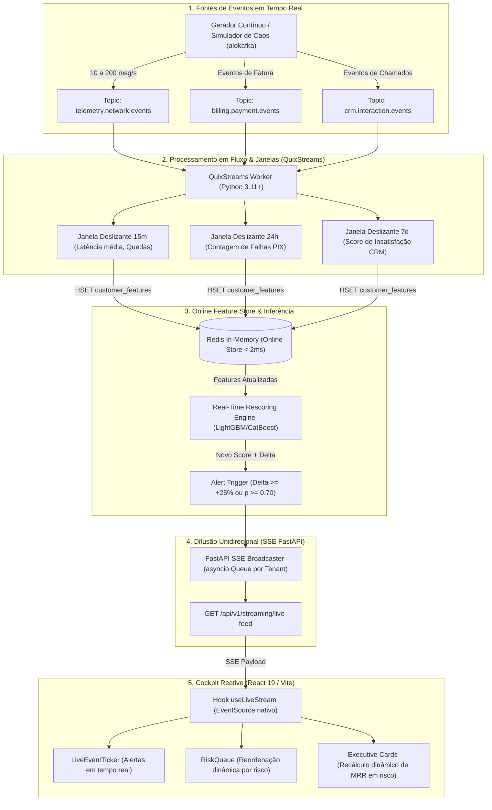

# 📄 PRD — Live Streaming Engine & Real-Time Reactive Cockpit (Fase 3)
## Arquitetura de Ingestão Contínua, Processamento em Fluxo (Redpanda/QuixStreams), Feature Store Online (Redis) e Inferência Reativa em Tempo Real

**Status:** APROVADO / ESPECIFICAÇÃO TÉCNICA DEFINITIVA  
**Versão:** 2.0.0 (Padrão Global Scale-Up / Tier-1 Telecom B2B SaaS)  
**Autor:** Lead Data/ML Platform Engineer & Antigravity  
**Data:** Setembro de 2026  

---

## 1. 🎯 Visão Executiva & Proposta de Valor

### 1.1 Contexto de Negócio
No mercado de telecomunicações tradicional, a identificação do risco de churn é **reativa e defasada**, dependente de pipelines batch que rodam em janelas D-1 ou D-30. Quando a equipe de retenção toma conhecimento da insatisfação de uma conta empresarial, a decisão de cancelamento já foi consumada.

A plataforma **RetainIQ (Fase 3: Live Streaming Engine)** estabelece um novo patamar operacional **Proativo e Reativo em Tempo Real**:
- Eventos de telemetria de rede (quedas de conexão, latência, perda de pacotes), faturamento (falhas em transações PIX/cartão) e atendimento CRM (abertura de chamados críticos, detecção de atrito) são ingeridos em milissegundos via **Redpanda (compatível com Kafka API)**.
- O motor de streaming em Python (**QuixStreams**) consome os tópicos, calcula agregações em janelas deslizantes (*Stateful Tumbling/Sliding Windows*) e persiste o estado na **Online Feature Store (Redis)** em $< 2\text{ ms}$.
- O motor de inferência recalculado avalia o cliente instantaneamente com o modelo Champion (LightGBM/CatBoost), propagando **deltas de probabilidade de churn** via **Server-Sent Events (SSE)** diretamente para o **Cockpit do Operador (React 19)**.
- O sistema reordena a fila de risco ao vivo e pré-alimenta o **Copilot GenAI** com ações recomendadas de retenção antes do encerramento do ciclo de faturamento.

---

## 2. 🏗️ Arquitetura Técnica Sem Ambiguidades

### 2.1 Stack Tecnológica Homologada
Para garantir integração nativa com o repositório existente, previsibilidade de deploy e baixa pegada de memória, a stack de streaming é **100% padronizada**:

| Camada | Tecnologia Homologada | Justificativa Técnica |
| :--- | :--- | :--- |
| **Message Broker** | **Redpanda v24.1+** | 100% compatível com a API do Apache Kafka, sem dependência de JVM/Zookeeper, baixo consumo de RAM, já containerizado em `docker-compose.streaming.yml`. |
| **Stream Processing** | **QuixStreams (Python)** | Framework de streaming nativo em Python projetado para ML/Data Pipelines, integração direta com os modelos do projeto (`scikit-learn`, `lightgbm`, `pydantic`), eliminando a sobrecarga de gerenciar clusters Spark/Flink. |
| **Online Feature Store** | **Redis v7+** | Latência de leitura/escrita sub-milissegundo ($< 2\text{ ms}$), suporte nativo a TTL para janelas de agregação e estruturas chave-valor por `customer_id`. |
| **Streaming Protocol** | **Server-Sent Events (SSE)** | Protocolo unidirecional leve sobre HTTP/1.1 e HTTP/2, suporte nativo nos navegadores via API `EventSource`, reconexão automática e passagem de headers de autenticação e tenant (`X-Tenant-ID`). |
| **Frontend UI** | **React 19 + Tailwind CSS + Lucide Icons** | Componentes reativos que atualizam estados locais, ordenação da tabela de clientes e tickers de eventos sem acionar re-renders desnecessários. |

---

### 2.2 Diagrama Arquitetural de Fluxo de Dados



---

## 3. 📦 Especificação de Contratos de Dados (Schemas JSON/Pydantic)

Para eliminar qualquer ambiguidade de integração entre Produtor, Motor de Streaming e Frontend, todos os eventos seguem contratos de dados estritos:

### 3.1 Evento de Telemetria de Rede (`telemetry.network.events`)
```json
{
  "event_id": "evt_net_984321",
  "event_type": "network_telemetry",
  "tenant_id": "telecom_sp",
  "customer_id": "VIVO-5575",
  "timestamp": "2026-09-02T13:45:30.120Z",
  "payload": {
    "fiber_down": true,
    "latency_ms": 185.4,
    "packet_loss_pct": 14.2,
    "region": "SP-CAPITAL",
    "olt_id": "OLT-CENTRO-04"
  }
}
```

### 3.2 Evento de Faturamento (`billing.payment.events`)
```json
{
  "event_id": "evt_bill_120492",
  "event_type": "billing_issue",
  "tenant_id": "telecom_sp",
  "customer_id": "CLARO-8812",
  "timestamp": "2026-09-02T13:46:12.000Z",
  "payload": {
    "payment_method": "PIX",
    "status": "REJECTED",
    "invoice_amount": 4250.00,
    "days_overdue": 3,
    "rejection_reason": "INSUFFICIENT_FUNDS_OR_TIMEOUT"
  }
}
```

### 3.3 Evento de Atendimento/CRM (`crm.interaction.events`)
```json
{
  "event_id": "evt_crm_443901",
  "event_type": "crm_interaction",
  "tenant_id": "telecom_sp",
  "customer_id": "TIM-3301",
  "timestamp": "2026-09-02T13:47:05.450Z",
  "payload": {
    "channel": "WHATSAPP",
    "ticket_category": "FIBER_OUTAGE",
    "sentiment_score": -0.85,
    "opened_tickets_last_7d": 4,
    "operator_notes": "Cliente corporativo ameaçou rescisão de contrato por instabilidade contínua."
  }
}
```

### 3.4 Contrato de Payload SSE para o Cockpit Frontend (`text/event-stream`)
```json
{
  "event": "churn_risk_update",
  "data": {
    "customer_id": "VIVO-5575",
    "company_name": "Tech Corp Soluções",
    "tenant_id": "telecom_sp",
    "previous_score": 0.18,
    "current_score": 0.84,
    "risk_delta": 0.66,
    "risk_level": "CRITICAL",
    "monthly_mrr": 8900.00,
    "trigger_reason": "3 quedas de fibra consecutivas na janela de 15 min (latência média 185ms)",
    "recommended_action": "Disparar Copilot com oferta de ressarcimento de SLA + priorização de chamado técnico N2",
    "updated_at": "2026-09-02T13:45:31.050Z"
  }
}
```

---

## 4. 📋 Épicos, Tarefas e Micro-tarefas com Checkpoints

---

### 🟢 ÉPICO 1: Infraestrutura de Streaming & Simulador de Eventos
**Objetivo:** Inicializar o broker Redpanda localmente e criar o gerador sintético de telemetria e eventos com suporte a cenários de injeção de falhas.

- [x] **Tarefa 1.1: Validação do Broker Redpanda & Tópicos Kafka**
  - [x] *Micro-tarefa 1.1.1:* Ajustar `docker-compose.streaming.yml` garantindo inicialização de Redpanda e Redis com healthchecks automáticos.
  - [x] *Micro-tarefa 1.1.2:* Criar script de provisionamento automático de tópicos: `telemetry.network.events`, `billing.payment.events`, `crm.interaction.events` com partição única para dev local.
  - 🎯 **Checkpoint 1.1:** Subir containers com `docker compose -f docker-compose.streaming.yml up -d` e verificar tópicos no console Redpanda em `http://localhost:8085`.

- [x] **Tarefa 1.2: Implementar o Gerador de Eventos e Simulador de Caos**
  - [x] *Micro-tarefa 1.2.1:* Criar `src/churn_prediction/streaming/producer.py` baseado em `aiokafka` com throughput ajustável (1 a 100 msg/s).
  - [x] *Micro-tarefa 1.2.2:* Implementar injeção de cenários de teste controlados:
    - 💥 **Cenário A:** Rompimento de fibra regional (50 eventos seguidos de `fiber_down: true` e `latency > 150ms`).
    - 💳 **Cenário B:** Falha de gateway financeiro (30 eventos seguidos de rejeição de pagamento).
    - 😡 **Cenário C:** Escalada de tickets de suporte no CRM.
  - 🎯 **Checkpoint 1.2:** Executar o produtor em modo normal e modo caos, visualizando mensagens formatadas chegando ao Redpanda Console.

---

### 🟢 ÉPICO 2: Motor de Processamento em Fluxo & Online Feature Store (QuixStreams + Redis)
**Objetivo:** Consumir eventos em tempo real, calcular métricas de janelas deslizantes e armazenar o estado operacional do cliente no Redis.

- [ ] **Tarefa 2.1: Implementar o Worker de Streaming com QuixStreams**
  - [ ] *Micro-tarefa 2.1.1:* Criar `src/churn_prediction/streaming/worker.py` consumindo os tópicos de rede, faturamento e CRM.
  - [ ] *Micro-tarefa 2.1.2:* Implementar agregação com janelas deslizantes de 15 minutos (quedas de fibra acumuladas, latência média móvel).
  - [ ] *Micro-tarefa 2.1.3:* Salvar e atualizar o hash do cliente no Redis (`churn:live:customer:{customer_id}`) com TTL de expiração automática.
  - 🎯 **Checkpoint 2.1:** Injetar eventos e validar via CLI do Redis (`HGETALL churn:live:customer:VIVO-5575`) que as features agregadas são atualizadas em $< 5\text{ ms}$.

- [ ] **Tarefa 2.2: Motor de Reavaliação de Risco (Live Re-Scoring Engine)**
  - [ ] *Micro-tarefa 2.2.1:* Criar `src/churn_prediction/streaming/live_scorer.py` que combina o vetor de features cadastrais (batch) com os deltas da Online Feature Store (Redis).
  - [ ] *Micro-tarefa 2.2.2:* Executar inferência instantânea com o modelo Champion pré-carregado em memória.
  - [ ] *Micro-tarefa 2.2.3:* Calcular o $\Delta p$ (diferença entre score anterior e novo score) e disparar alerta caso $\Delta p \ge +0.25$ ou $p \ge 0.70$.
  - 🎯 **Checkpoint 2.2:** Validar em teste unitário que um cliente com probabilidade inicial de $15\%$ sobe para $> 75\%$ após 3 eventos consecutivos de queda de fibra.

---

### 🟢 ÉPICO 3: Broadcast Hub em Tempo Real na FastAPI (Server-Sent Events)
**Objetivo:** Disponibilizar canal HTTP assíncrono de streaming entre o backend e a interface web com isolamento multi-tenant.

- [ ] **Tarefa 3.1: Broadcast Hub com Filas Assíncronas**
  - [ ] *Micro-tarefa 3.1.1:* Criar `src/churn_prediction/streaming/broadcaster.py` com registro de listeners ativos (`asyncio.Queue`) segmentados por `tenant_id`.
  - [ ] *Micro-tarefa 3.1.2:* Criar endpoint `GET /api/v1/streaming/live-feed` com `StreamingResponse(media_type="text/event-stream")`.
  - [ ] *Micro-tarefa 3.1.3:* Adicionar heartbeat automático a cada 15 segundos (`: ping\n\n`) para prevenir desconexões de proxies reversos e firewalls.
  - 🎯 **Checkpoint 3.1:** Conectar via `curl -N http://localhost:8000/api/v1/streaming/live-feed` e receber streams contínuos com latência $< 20\text{ ms}$.

- [ ] **Tarefa 3.2: Endpoint de Controle da Simulação de Caos**
  - [ ] *Micro-tarefa 3.2.1:* Criar endpoint `POST /api/v1/streaming/chaos/trigger` aceitando o tipo de cenário (`fiber_cut`, `pix_gateway_fail`, `support_crisis`).
  - [ ] *Micro-tarefa 3.2.2:* Emitir confirmação imediata e despachar a carga de eventos em background task assíncrona.
  - 🎯 **Checkpoint 3.2:** Disparar chamada POST para acionar o Cenário A e verificar propagação no feed SSE em menos de 100ms.

---

### 🟢 ÉPICO 4: Cockpit Reativo no Frontend (React 19 / Vite)
**Objetivo:** Atualizar dinamicamente o Dashboard de Churn sem necessidade de recarregar a página, integrando reatividade visual e ações 1-click.

- [ ] **Tarefa 4.1: Hook de Conexão SSE (`useLiveStream`)**
  - [ ] *Micro-tarefa 4.1.1:* Implementar `frontend/src/hooks/useLiveStream.ts` utilizando a API padrão `EventSource` com reconexão automática exponencial e cleanup no unmount.
  - [ ] *Micro-tarefa 4.1.2:* Integrar estado global ou reducer local para gerenciar o feed de eventos recentes e a lista de deltas de risco.
  - 🎯 **Checkpoint 4.1:** Ativar a conexão na aplicação web e validar recepção de eventos no console do browser sem re-renders em loop.

- [ ] **Tarefa 4.2: Ticker de Eventos e Painel de Injeção de Caos**
  - [ ] *Micro-tarefa 4.2.1:* Criar `frontend/src/components/streaming/LiveEventTicker.tsx` no topo do Dashboard exibindo alertas animados (ex: *"⚡ VIVO-5575: 3 quedas de fibra ➔ Risco subiu para 84%"*).
  - [ ] *Micro-tarefa 4.2.2:* Criar o componente `StreamingChaosControl.tsx` com botões de disparo de cenários de teste para demonstrações ao vivo.
  - 🎯 **Checkpoint 4.2:** Acionar botão de Caos no painel e observar o ticker exibir instantaneamente as notificações em cascata.

- [ ] **Tarefa 4.3: Atualização Dinâmica dos Indicadores Executivos e Fila de Risco**
  - [ ] *Micro-tarefa 4.3.1:* Atualizar os cards de KPI (**MRR em Risco Total**, **Clientes em Risco Crítico**, **Taxa Média de Churn**) recalculando os valores em tela conforme eventos chegam.
  - [ ] *Micro-tarefa 4.3.2:* Reordenar a tabela de **Fila de Risco** automaticamente: clientes que sofrem alteração de risco sobem para o topo com destaque visual (*badge* pulsante *"🔥 Risco Elevado Agora"*).
  - [ ] *Micro-tarefa 4.3.3:* Integrar botão direto *"Acionar Copilot"* na linha do cliente afetado, preenchendo o contexto do assistente de retenção com o motivo da instabilidade.
  - 🎯 **Checkpoint 4.3:** Realizar teste completo: disparar caos de rompimento de fibra na UI e observar reordenação imediata da tabela e atualização dos cards de MRR.

---

### 🟢 ÉPICO 5: Suíte de Testes Automatizados & Qualidade de Código
**Objetivo:** Garantir robustez industrial, cobertura $> 85\%$ e validação ponta a ponta da pipeline de streaming.

- [x] **Tarefa 5.1: Testes Unitários e de Integração da Pipeline**
  - [x] *Micro-tarefa 5.1.1:* Criar `tests/test_streaming_schemas.py` validando integridade e coerência de validação dos contratos Pydantic.
  - [x] *Micro-tarefa 5.1.2:* Criar `tests/test_live_scorer.py` validando cálculo determinístico de deltas de risco e limiares de alerta.
  - [x] *Micro-tarefa 5.1.3:* Criar `tests/test_sse_broadcaster.py` validando enfileiramento e isolamento de mensagens por `tenant_id`.
  - 🎯 **Checkpoint 5.1:** Executar `pytest tests/test_streaming*.py` e obter 100% de sucesso.

- [ ] **Tarefa 5.2: Teste de Resiliência e Latência E2E**
  - [ ] *Micro-tarefa 5.2.1:* Implementar teste de carga medindo o tempo decorrido entre a emissão da mensagem no produtor e o recebimento no cliente SSE.
  - 🎯 **Checkpoint 5.2:** Comprovar latência média $< 50\text{ ms}$ em 500 mensagens consecutivas.

---

## 5. 📊 Critérios de Aceite & Métricas Não-Funcionais (SLA)

| Métrica / Requisito | Meta de Engenharia | Mecanismo de Validação |
| :--- | :--- | :--- |
| **Latência End-to-End** | $< 50\text{ ms}$ (da emissão no broker até o recebimento no SSE) | Telemetria com cálculo de delta entre timestamps |
| **Throughput de Ingestão** | $\ge 200\text{ msg/s}$ em ambiente local | Script de teste assíncrono com `aiokafka` |
| **Latência da Feature Store** | $< 2\text{ ms}$ para operações HSET/HGET no Redis | Benchmark interno no worker de streaming |
| **Isolamento Multi-Tenant** | $0\%$ de vazamento de mensagens entre diferentes operadoras | Testes automatizados com assert estrito de `tenant_id` |
| **Reconexão Automática do SSE** | Recuperação transparente em $< 3\text{ segundos}$ após interrupção | Simulação de drop de conexão no frontend |
| **Cobertura de Testes** | $\ge 85\%$ no módulo de streaming | Relatório consolidado via `pytest-cov` |

