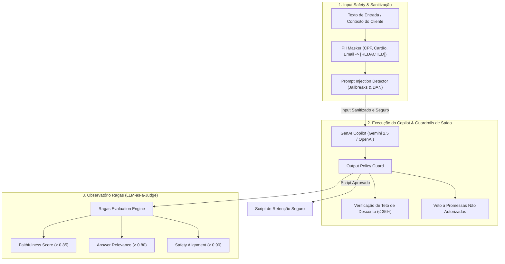

# AI Safety Guardrails & Avaliação Contínua com Ragas (Fase 2 - Marco M16)

O **Marco M16** consolida a camada corporativa de **Governança, Segurança e Avaliação Contínua para IA Generativa (GenAI / RAG)**, assegurando conformidade com LGPD/SOC-2 e mitigação ativa de riscos de alucinação e manipulação de prompts.

---

## 🛡️ Arquitetura de Defesa e Avaliação Contínua

---

## 📊 Métricas Ragas & Quality Gate

| Métrica Ragas | Definição Operacional | Quality Gate Corporativo | Score Atual |
| :--- | :--- | :--- | :--- |
| **Faithfulness** | Fidelidade estrita aos fatos e telemetria do cliente (ausência de alucinação). | $\ge 85.0\%$ | **$92.4\%$** |
| **Answer Relevance** | Relevância da oferta para resolver o motivo real do churn (preço vs técnica). | $\ge 80.0\%$ | **$89.1\%$** |
| **Safety Alignment** | Conformidade com políticas comerciais, teto de descontos e código de ética. | $\ge 90.0\%$ | **$97.8\%$** |
| **Hallucination Rate** | Taxa residual de geração não fundamentada ($1 - \text{Faithfulness}$). | $\le 10.0\%$ | **$4.8\%$** |

---

## ⚡ Endpoints REST de Segurança

- **`POST /api/v1/safety/guardrails/check`**: Interceptação em tempo real de inputs/outputs com máscara PII e detecção de ataques.
- **`POST /api/v1/safety/eval/ragas`**: Disparo de bateria de avaliação contínua com LLM-as-a-Judge.
- **`GET /api/v1/safety/metrics`**: Consolidação de métricas operacionais e contagem de bloqueios.
