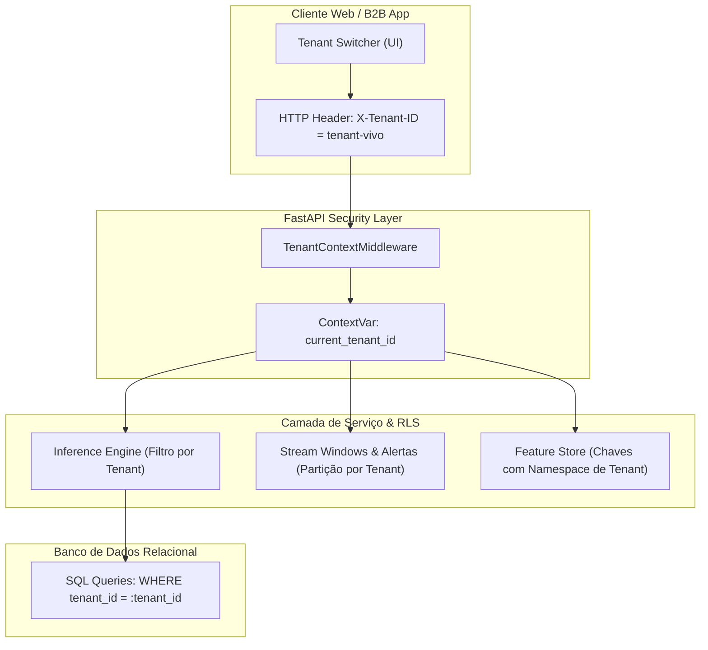

# Multi-Tenancy Estrito & Row-Level Security (Fase 2 - Marco M14)

O **Marco M14** estabelece o modelo de isolamento corporativo **Multi-Tenant (B2B SaaS)** para que operadoras distintas (como Vivo, Claro, TIM) compartilhem a mesma infraestrutura computacional com isolamento estrito de dados, predições, alertas e modelos.

---

## 🛡️ Camadas de Isolamento & Segurança

---

## 🏢 Tenants Pré-Configurados

| Tenant ID | Nome da Operadora | Plano Contratual | Quota (RPS) | Modelo Customizado |
| :--- | :--- | :--- | :--- | :--- |
| **`tenant-default`** | RetainIQ Global | Dedicated | $500\text{ req/s}$ | Sim (Global Champion) |
| **`tenant-vivo`** | Vivo Telecom B2B | Enterprise | $300\text{ req/s}$ | Sim (Treinado com Dados Vivo) |
| **`tenant-claro`** | Claro Brasil | Enterprise | $300\text{ req/s}$ | Não (Usa Global Champion) |
| **`tenant-tim`** | TIM Celular | Standard | $150\text{ req/s}$ | Não (Usa Global Champion) |

---

## ⚡ Endpoints REST de Gestão Multi-Tenant

- **`GET /api/v1/tenants`**: Lista todas as operadoras provisionadas na plataforma.
- **`POST /api/v1/tenants`**: Provisiona um novo tenant com rate limit e isolamento RLS.
- **`GET /api/v1/tenants/{tenant_id}/summary`**: Retorna volumetria, clientes ativos e ROI específico do tenant.
