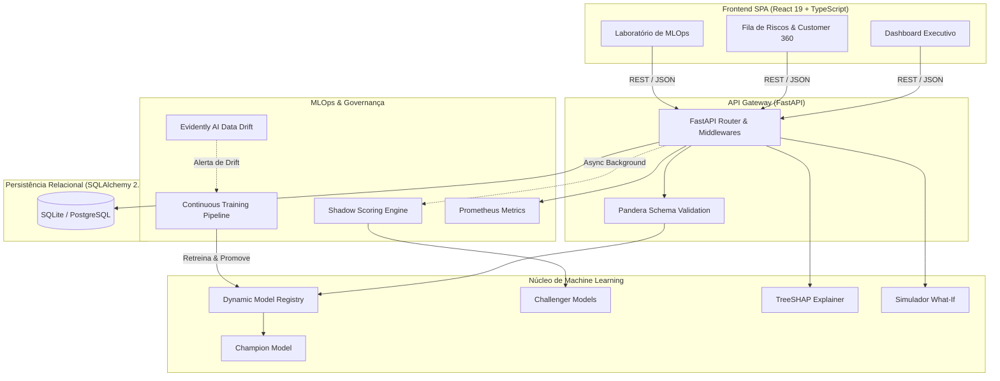

# Arquitetura do Sistema

O RetainIQ adota uma arquitetura desacoplada, orientada a contratos e assíncrona, projetada para alta performance e separação estrita de responsabilidades.

---

## 🏛️ Diagrama de Arquitetura

---

## 🧩 Componentes Principais

### 1. Ingestão & Validação Estrita (Pandera)
Todos os dados recebidos via JSON ou CSV passam pela camada de validação do Pandera (`churn_prediction.data.contracts`), garantindo conformidade de tipos, limites de valores e ausência de campos corrompidos antes de chegar aos modelos de ML.

### 2. Dynamic Model Registry & Serving
O gerenciador de modelos (`churn_prediction.models.registry`) mantém os artefatos serializados em memória e viabiliza:
- Inferência ultrarrápida ($p99 < 1\text{ ms}$).
- Promoção atômica de modelos via API sem necessidade de reinicialização do serviço (*hot-swap*).

### 3. Shadow Scoring Não-Bloqueante
Enquanto o modelo *Champion* retorna a predição para o usuário em tempo real, uma rotina em background avalia os modelos *Challengers*, registrando métricas de concordância e divergência estatística.

### 4. Persistência Assíncrona & Fechamento de Ciclo
Utiliza SQLAlchemy 2.0 Async ORM para registrar:
- Predições e logs de auditoria.
- Ações de retenção executadas por analistas.
- Desfechos reais (*Ground Truth*) e acompanhamento de receita preservada.
