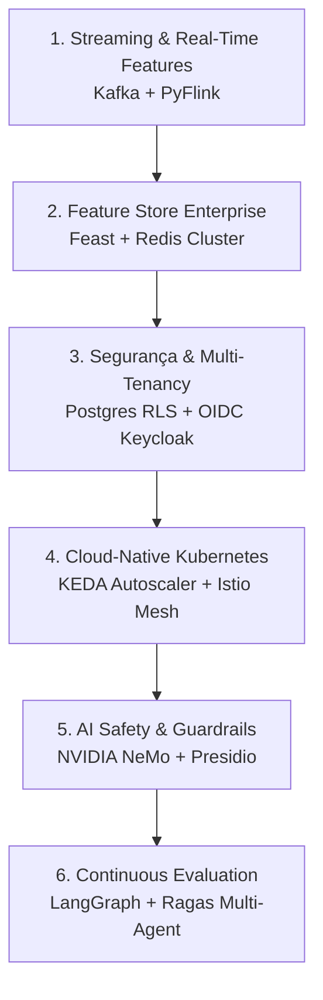

# Arquitetura de Escala Global (Fase 2)

Este documento sintetiza o blueprint arquitetural corporativo de hiperescala para quando o RetainIQ for implantado em operadoras com dezenas de milhões de assinantes ativos e mais de **100.000 requisições por segundo**.

---

## 🏛️ Os 6 Pilares de Hiperescala

### 1. Ingestão em Streaming (Kafka + Flink)
- Tópicos particionados por `customer_id` (`telemetry.network.events`, `billing.payment.events`).
- Stateful Stream Processing com janelas deslizantes (ex: quedas de sinal na última 1h).

### 2. Feature Store (Feast + Redis)
- **Online Store:** Baixa latência ($< 2\text{ ms}$) no Redis Cluster para inferência em tempo real.
- **Offline Store:** BigQuery / Snowflake com *point-in-time joins* matematicamente livres de data leakage.

### 3. Multi-Tenancy & Segurança LGPD/GDPR
- Isolamento nativo via **PostgreSQL Row-Level Security (RLS)** usando `tenant_id`.
- Autenticação OIDC com JWT assinado (RS256).
- *Right to be Forgotten* via **Crypto-Shredding** de chaves de criptografia por cliente.

### 4. Cloud-Native Kubernetes (KEDA + Istio)
- Autoscaling baseado em métricas de negócio e *Kafka lag*.
- Roteamento inteligente Canary e *Traffic Shadowing* via Istio Service Mesh com mTLS mútuo.

### 5. AI Safety & GenAI Guardrails
- Sanitização de dados sensíveis (PII) antes do envio a LLMs.
- Bloqueio determinístico de concessão indevida de descontos.

### 6. Continuous Evaluation com Ragas
- Avaliação contínua de fidelidade (*Faithfulness*) e aderência de tom nos roteiros de negociação.
