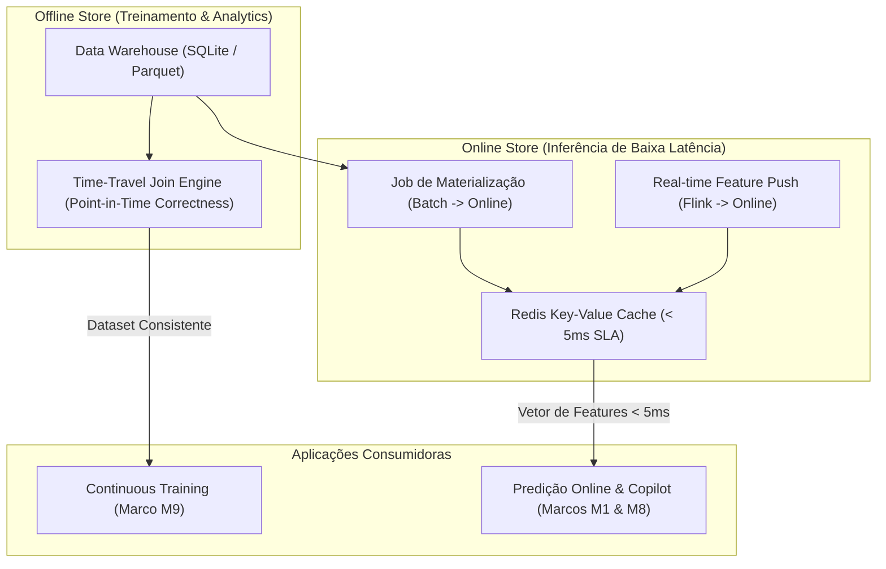

# Feature Store Unificada em Tempo Real (Fase 2 - Marco M13)

O **Marco M13** estabelece a arquitetura de **Feature Store Unificada** inspirada nos padrões do **Feast**, desenhada para unificar fontes *Batch* (Data Warehouse / CRM) e fontes *Streaming* (Apache Flink / Redpanda).

---

## 🎯 Por que uma Feature Store Corporativa?

Em sistemas tradicionais de Machine Learning, ocorrem dois problemas críticos:

1. **Training-Serving Skew (Inconsistência Treino vs. Produção):**
   - No treino, cientistas de dados calculam agregações em SQL. Em produção, engenheiros recalculam em Python, gerando divergências sutis que degradam a acurácia.
2. **Data Leakage (Vazamento Temporal de Dados):**
   - Treinar modelos sem junção baseada no ponto do tempo exato (*Point-in-Time Correctness*) usa informações do "futuro" que não estariam disponíveis no momento da predição.

---

## 🏗️ Arquitetura Feast (Dual Store)

---

## 📋 Feature Views Cadastradas

### 1. `customer_demographic_features` (Batch / DW)
- **Campos:** `SeniorCitizen`, `Partner`, `Dependents`, `Contract`, `PaperlessBilling`, `PaymentMethod`.
- **TTL:** 30 dias.

### 2. `customer_financial_features` (Batch / Billing)
- **Campos:** `tenure`, `MonthlyCharges`, `TotalCharges`.
- **TTL:** 30 dias.

### 3. `customer_realtime_stream_features` (Stream / Flink M12)
- **Campos:** `avg_latency_15min`, `avg_packet_loss_15min`, `disconnect_count_1h`, `failed_payment_count_24h`, `negative_crm_count_7d`, `avg_sentiment_7d`, `realtime_instability_score`.
- **TTL:** 7 dias.

---

## ⚡ Endpoints REST da Feature Store

- **`GET /api/v1/features/catalog`**: Retorna todas as Feature Views e seus esquemas de tipos.
- **`GET /api/v1/features/stats`**: Retorna métricas operacionais e volumetria da Online Store.
- **`POST /api/v1/features/online`**: Recuperação vetorial de features com latência $< 5\text{ ms}$.
- **`POST /api/v1/features/materialize`**: Sincronização programada da Offline Store para a Online Store.
