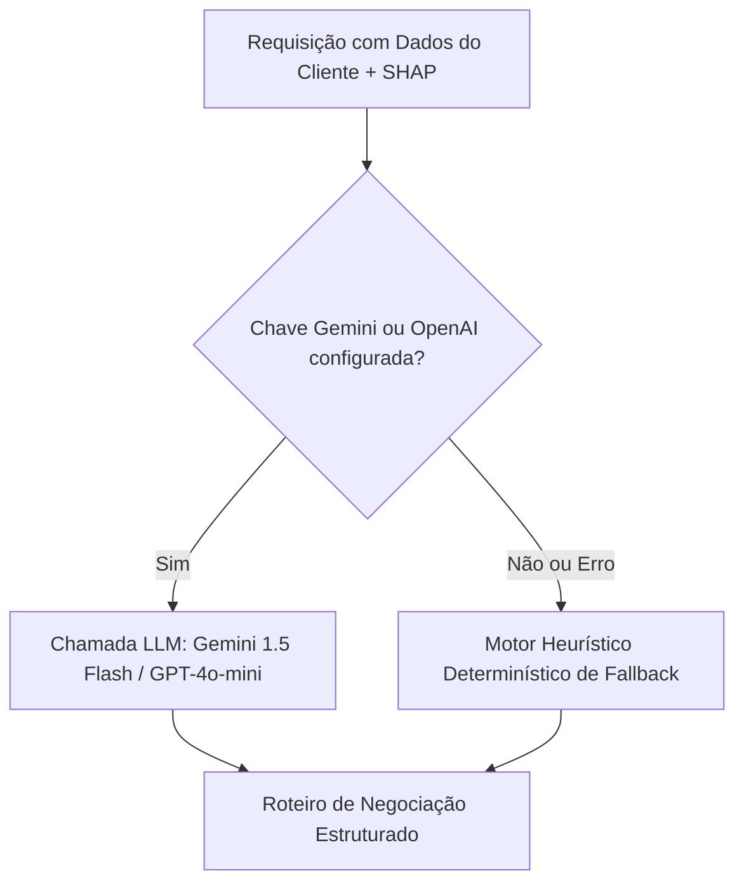

# Copilot GenAI de Retenção & Negociação

O **Copilot de Retenção** do RetainIQ auxilia a equipe de atendimento com geração automatizada de roteiros comerciais personalizados.

---

## 🤖 Arquitetura Multi-Provedor com Fallback

---

## 🎭 Motor de Variação de Tom

O usuário pode alternar dinamicamente o estilo de comunicação:
- **Empático:** Focado em acolhimento, escuta ativa e compreensão das insatisfações.
- **Firme:** Focado na exclusividade da oferta, valor dos benefícios e senso de urgência.
- **Consultivo:** Abordagem analítica comparando custo-benefício e otimização de planos.
- **Direto:** Comunicação objetiva e simplificada para WhatsApp e mensagens rápidas.
