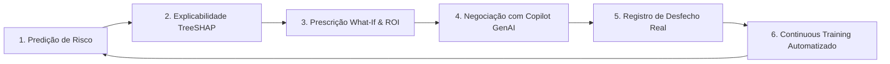

# RetainIQ — Customer Retention Intelligence & MLOps Platform

Bem-vindo à documentação técnica oficial da plataforma **RetainIQ**.

O **RetainIQ** é uma solução completa de Inteligência Artificial aplicada ao negócio que transforma a predição tradicional de cancelamento (*churn*) em uma operação de retenção prescritiva, mensurável e com governança de MLOps de ponta a ponta.

---

## 🎯 O Ciclo Operacional RetainIQ

---

## 🚀 Principais Capacidades

=== "Ciência de Dados & ML"
    - **Zero Data Leakage:** Pipelines Scikit-Learn com pré-processamento estritamente isolado no conjunto de treino.
    - **Validação com Pandera:** Contratos de tipos, intervalos e coerência de dados validados em runtime.
    - **Benchmark Multi-Algoritmo:** Comparação entre XGBoost, HistGradientBoosting, Regressão Logística e Random Forest.
    - **Métrica Norte:** Otimização orientada a **PR-AUC** e calibração de probabilidade via **Brier Score**.

=== "Engenharia de MLOps"
    - **Dynamic Model Registry:** Catálogo em memória com promoção atômica (*zero downtime*).
    - **Shadow Scoring:** Inferência paralela em segundo plano para modelos concorrentes (*Challengers*).
    - **Continuous Training (CT):** Pipeline automatizado de retreino com **Quality Gate** de aprovação.
    - **Monitoramento de Drift:** Detecção estatística de desvio de dados com **Evidently AI**.

=== "Negócio & GenAI"
    - **Priorização Financeira:** Fila de atendimento ordenada por **MRR em Risco** ($\text{Mensalidade} \times p(\text{Churn})$).
    - **Explicabilidade TreeSHAP:** Decomposição exata de fatores que elevam ou reduzem o risco.
    - **Simulador What-If:** Estimativa do novo risco e do ROI anual de ações de retenção.
    - **Copilot de Negociação:** Assistente inteligente com suporte a Gemini/OpenAI e fallback determinístico 100% resiliente.

---

## 📊 Navegação Rápida

-   :material-rocket-launch: **[Como Iniciar](getting-started.md)**
    ---
    Instalação passo a passo com `uv`, Docker e execução local.

-   :material-server-network: **[Arquitetura do Sistema](architecture/overview.md)**
    ---
    Diagramas C4, componentes e fluxo de dados.

-   :material-chart-bell-curve-cumulative: **[Modelagem & Benchmarks](ml-data/modeling-benchmarks.md)**
    ---
    Métricas de teste, PR-AUC e seleção de modelos.

-   :material-robot-excited: **[Copilot GenAI](genai/copilot.md)**
    ---
    Integração de LLMs e roteiros comerciais com variação de tom.

-   :material-api: **[Referência da API](api/endpoints.md)**
    ---
    Catálogo completo dos endpoints FastAPI.

-   :material-code-json: **[Referência de Código](reference/models-registry.md)**
    ---
    Documentação gerada automaticamente a partir das docstrings.

