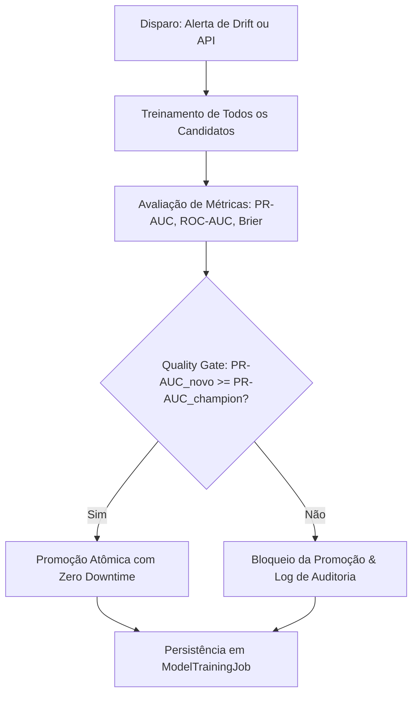

# Continuous Training & Quality Gate

O pipeline de **Continuous Training (CT)** do RetainIQ viabiliza a evolução contínua dos modelos preditivos com garantia estrita de qualidade.

---

## 🔄 Fluxo de Retreinamento Contínuo

---

## 🛡️ Quality Gate Rigoroso

O pipeline só permite substituir o modelo Champion se o novo candidato demonstrar superioridade ou paridade na métrica oficial:

$$PR\text{-}AUC_{\text{candidato}} \ge PR\text{-}AUC_{\text{champion}}$$

Todas as tentativas são registradas na tabela `model_training_jobs` para fins de auditoria de conformidade.
