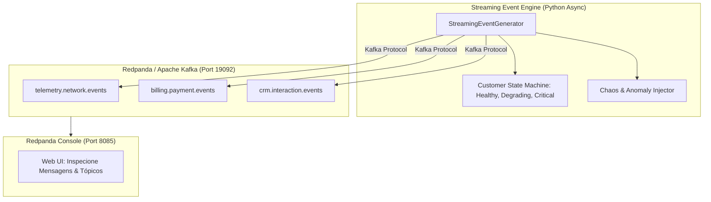

# Gerador Contínuo de Eventos em Streaming (Fase 2)

O **Marco M11** estabelece a infraestrutura de geração contínua de eventos em tempo real, servindo como o *heartbeat* da **Fase 2 (Global Scale-Up Architecture)**.

---

## 📡 Tópicos & Esquemas de Eventos

O subsistema emite eventos estruturados com validação via **Pydantic v2** nos 3 principais tópicos de negócio:

### 1. `telemetry.network.events`
- **Origem:** Roteadores, modems ópticos e antenas 4G/5G.
- **Campos:** `download_speed_mbps`, `upload_speed_mbps`, `latency_ms`, `packet_loss_pct`, `disconnect_count_last_hour`.
- **Propósito:** Detectar anomalias de conexão e degradações técnicas que antecedem o cancelamento voluntário.

### 2. `billing.payment.events`
- **Origem:** Gateway de pagamento e faturamento bancário.
- **Campos:** `invoice_amount`, `attempt_number`, `payment_method`, `error_code`, `error_reason`.
- **Propósito:** Rastrear falhas sucessivas de cartão de crédito e recusas de débito (risco de churn involuntário).

### 3. `crm.interaction.events`
- **Origem:** URA de atendimento, SAC, WhatsApp e aplicativo.
- **Campos:** `channel`, `reason`, `sentiment_score` ($-1.0$ a $+1.0$), `duration_seconds`, `notes`.
- **Propósito:** Mapear insatisfações críticas e contestações de fatura.

---

## 🏗️ Arquitetura de Streaming & Redpanda



---

## 🚀 Como Subir o Cluster Redpanda Localmente

Execute o compose de streaming:

```bash
docker compose -f docker-compose.streaming.yml up -d
```

- **Kafka Broker:** `localhost:19092`
- **Redpanda Console (UI Web):** 👉 **`http://localhost:8085`**
