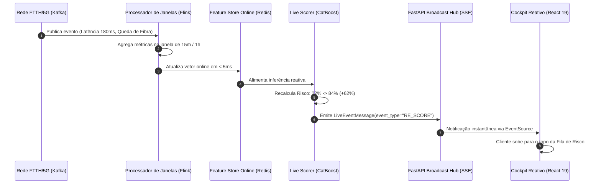

# ⚡ Arquitetura Live Streaming & Cockpit Reativo em Tempo Real

A **Fase 3** do RetainIQ introduz uma arquitetura orientada a eventos (*Event-Driven Streaming*) de nível Global Scale-Up / Tier-1 Telecom.

---

## 🏛️ Visão Geral da Arquitetura

O sistema opera no paradigma **Lambda/Kappa Streaming First**, integrando ingestão em alta velocidade via Kafka, janelas deslizantes com Flink, Feature Store Online de baixa latência e transmissão via Server-Sent Events (SSE).

---

## 📊 Componentes Principais

### 1. Hub de Difusão Server-Sent Events (`broadcaster.py`)
- Endpoint: `GET /api/v1/streaming/live-feed`
- Protocolo: `text/event-stream` com heartbeat a cada 10s.
- Suporte nativo a **Row-Level Security (RLS)**: filtra eventos por `tenant_id` (`tenant-vivo`, `tenant-claro`, `tenant-tim`, `tenant-default`).

### 2. Motor de Reavaliação Dinâmica (`live_scorer.py`)
- Combina dados demográficos canônicos com a telemetria agregada das janelas deslizantes.
- Dispara alertas automáticos quando o delta de risco ($\Delta p$) atinge ou supera $+25\%$.

### 3. Simulador de Caos Corporativo
- 💥 **Rompimento de Fibra Ótica (SP):** Injeta rajadas de latência alta e desconexões consecutivas.
- 💳 **Falha de Gateway PIX:** Simula falhas em série de cobrança bancária.
- 😡 **Crise de Fila no CRM:** Simula aumento de tempo de espera e sentimento negativo no WhatsApp.
