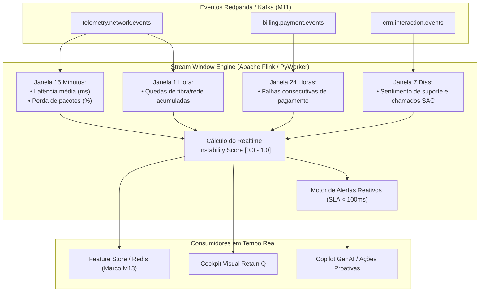

# Processamento em Tempo Real com Apache Flink (Fase 2 - Marco M12)

O **Marco M12** implementa o motor de processamento de fluxo contínuo (*Stream Processing*) com estado (*Stateful Processing*), janelas deslizantes (*Sliding Windows*) e disparo de alertas reativos com latência inferior a $100\text{ ms}$.

---

## 🏗️ Arquitetura de Janelas Deslizantes (*Sliding Windows*)

Enquanto o treinamento tradicional de Machine Learning opera em lotes (*batch* diários ou semanais), clientes com problemas agudos de conectividade ou insatisfação financeira demandam **intervenção proativa imediata**.

---

## ⏱️ Janelas Deslizantes Suportadas

| Janela | Escopo | Métricas Computadas | Limiar de Alerta Crítico |
| :--- | :--- | :--- | :--- |
| **15 Minutos** | Qualidade de Rede | `avg_latency_15min`, `avg_packet_loss_15min` | Latência $> 150\text{ ms}$ e Perda $> 10\%$ |
| **1 Hora** | Estabilidade de Fibra | `disconnect_count_1h` | $\ge 3$ quedas de sinal na hora |
| **24 Horas** | Saúde Financeira | `failed_payment_count_24h` | $\ge 2$ tentativas de cobrança recusadas |
| **7 Dias** | Sentimento de CRM | `negative_crm_count_7d`, `avg_sentiment_7d` | Sentimento $\le -0.40$ em chamados de suporte |

---

## ⚡ Fórmula do Score de Instabilidade em Tempo Real

A cada novo evento ingerido pelo motor de streaming, o cliente tem seu score de volatilidade recalculado dinamicamente:

$$\text{Instability Score} = \min\left(1.0, 0.40 \times \frac{\text{Quedas}_{1h}}{3} + 0.20 \times \frac{\text{Latência}_{15m}}{200} + 0.25 \times \frac{\text{Falhas}_{24h}}{2} + 0.15 \times \mathbb{I}(\text{Sentimento} < -0.3)\right)$$

---

## 🚨 Fila de Alertas Reativos de Churn

Quando as regras de risco são violadas, um `RealtimeRiskAlert` é gerado e disponibilizado via API REST:

- **`GET /api/v1/streaming/windows`**: Lista todas as janelas dos clientes em monitoramento ativo.
- **`GET /api/v1/streaming/windows/{customer_id}`**: Detalhes em tempo real de um cliente específico.
- **`GET /api/v1/streaming/alerts`**: Fila de alertas para atendimento proativo.
- **`POST /api/v1/streaming/alerts/{alert_id}/acknowledge`**: Confirmação de atendimento por um operador ou sistema automatizado.
