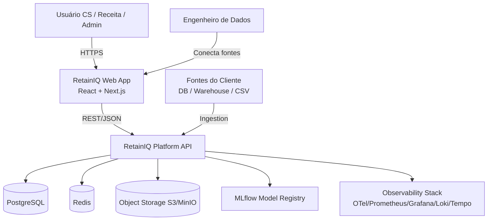
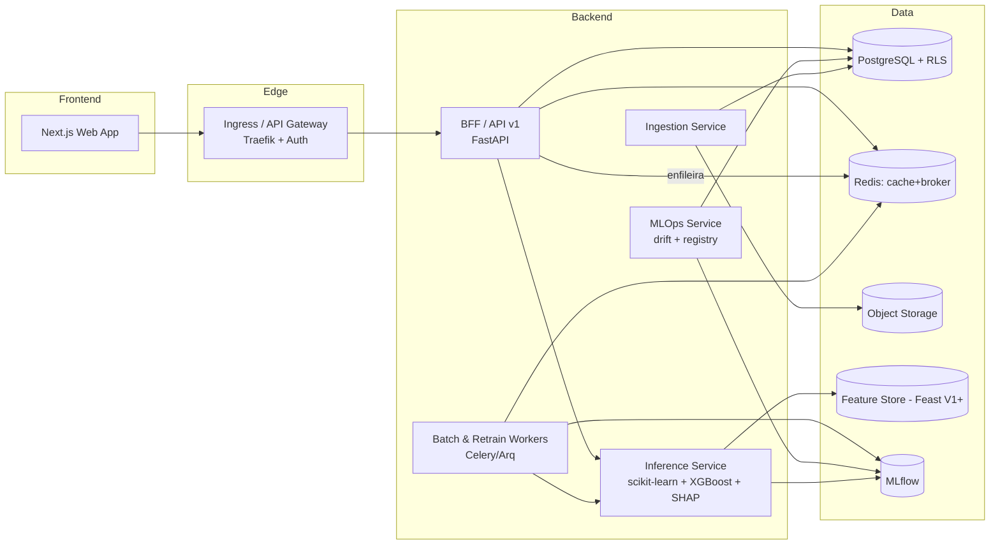
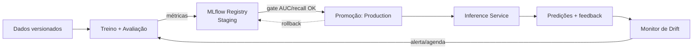

# 04 — Proposta de Arquitetura

> Arquitetura de referência do RetainIQ usando o modelo **C4** (Contexto,
> Contêineres, Componentes) em diagramas ASCII/Mermaid. Decisões formais em
> `11_risks_assumptions_adr.md`.

---

## 1. Visão Geral e Estilo Arquitetural

- **Estilo:** **monólito modular** evoluindo para **microsserviços seletivos**
  (ver `ADR-03`). Começa simples e operável; extrai serviços apenas onde a escala
  ou o ciclo de deploy exigem.
- **Multi-tenancy:** isolamento **lógico** (tenant_id + Row-Level Security no
  Postgres) no MVP; caminho para isolamento físico em planos enterprise.
- **Async-first** para trabalho pesado (batch scoring, re-treino).
- **12-Factor App** + **stateless services**.

---

## 2. C4 Nível 1 — Contexto



---

## 3. C4 Nível 2 — Contêineres



---

## 4. C4 Nível 3 — Componentes do Inference Service

> Este serviço é a **evolução direta** do `src/churn_prediction/api` atual.

```
Inference Service
├── api/            HTTP layer (FastAPI routers, RFC7807 errors)
├── schemas/        Pydantic V2 + Adapter PT↔EN por locale
├── domain/         Regras: risk_class, priorização (score × valor)
├── ml/
│   ├── model_loader.py     carrega pipeline do MLflow (cache em memória)
│   ├── predictor.py        predict + predict_proba
│   └── explainer.py        SHAP -> drivers em linguagem de negócio
├── observability/  logging estruturado, métricas, tracing OTel
└── repository/     persistência de predições (Postgres)
```

**Decisões herdadas e mantidas:**
- Pipeline scikit-learn encapsulando pré-processamento + modelo (anti-leakage).
- Modelo carregado em memória no *lifespan* (baixa latência).
- Adapter PT↔EN no schema (agora parametrizado por locale).

---

## 5. Modelo de Multi-Tenancy

| Aspecto | MVP | Enterprise (Futuro) |
|---------|-----|---------------------|
| Isolamento de dados | `tenant_id` + **Row-Level Security** no Postgres | Schema/DB dedicado |
| Identidade | Token JWT com `tenant` + `roles` | + SSO (OIDC/SAML), SCIM |
| Modelos ML | Global versionado + override por tenant | Modelo dedicado por tenant |
| Limites | Rate limit e cotas por tenant | SLA e capacidade reservada |

> `ADR-02` registra a escolha de RLS para o MVP.

---

## 6. Ciclo de Vida do Modelo (MLOps)



- **Gate de qualidade:** promoção só ocorre se métricas ≥ baseline (recall/AUC).
- **Rollback:** versão anterior sempre disponível para reversão imediata.
- **Shadow / Canary:** novo modelo recebe tráfego parcial antes da promoção total.

---

## 7. Padrões Arquiteturais Aplicados

| Padrão | Onde | Valor |
|--------|------|-------|
| **Adapter** | Schemas PT↔EN | Desacopla domínio de negócio do modelo |
| **Repository** | Persistência | Testabilidade, troca de storage |
| **Strategy** | Seleção de modelo por tenant | Flexibilidade de versionamento |
| **CQRS leve** | Leitura analítica vs. escrita operacional | Performance |
| **Outbox** | Eventos de ação/feedback | Consistência eventual confiável |
| **Circuit Breaker / Retry** | Chamadas a serviços/fontes externas | Resiliência |
| **BFF** | Camada para o frontend | Agregação e segurança |

---

## 8. Topologia de Implantação (Kubernetes)

```
Namespace: retainiq
├── Deployment: web (Next.js)            [HPA]
├── Deployment: api-bff (FastAPI)        [HPA]
├── Deployment: inference                [HPA + readiness no model load]
├── Deployment: workers (batch/retrain)  [KEDA scale-on-queue]
├── Deployment: mlops
├── StatefulSet: postgres (ou RDS gerenciado)
├── Deployment: redis (ou ElastiCache)
├── Ingress: traefik (TLS, rate limit)
└── Observability: otel-collector, prometheus, grafana, loki, tempo
```

- **Ambientes:** `dev` (k3d/kind local) → `staging` (ephemeral por PR) → `prod`.
- **Zero-downtime:** rolling updates + readiness probes (modelo carregado).

---

## 9. Decisões-Chave (resumo)

Ver `11_risks_assumptions_adr.md` para o registro completo. Destaques:

- **ADR-01** — FastAPI + Python como núcleo (reuso do existente).
- **ADR-02** — Multi-tenancy por RLS no MVP.
- **ADR-03** — Monólito modular antes de microsserviços.
- **ADR-04** — MLflow para registro/versionamento de modelos.
- **ADR-05** — OpenTelemetry como padrão único de instrumentação.

